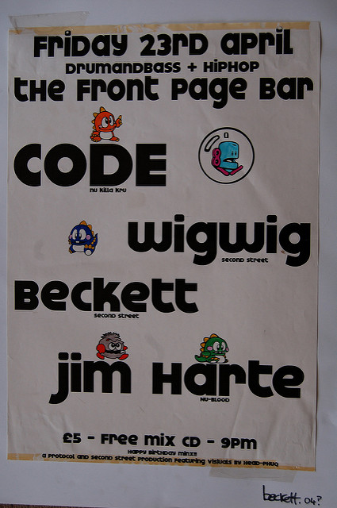

## Design, of the graphic sort
At some stage during my DJ'ing days, myself and my partner in crime realised that we'd get more gigs if we ran nights ourselves. So, we did, and we did.

We also got the arse-ache of having to promote the nights. Promotion, especially of a genre of music that at best people think is 'a bit mental', is hard at the best of times, I don't think there are any valuable career lessons here, other than, fly-posting is most likely a chore in some circle of hell, and don't try doing it when there are riots.

### Thievery Corporation
Anyway, to promote a night you need posters and flyers, I had a computer, a backup copy of photoshop, and set about plagarising all that had come before me, and therein lies Valuable lesson 1, stand on the shoulders of giants. I copied the ideas and layouts of flyers from other nights. 

Bold Text, stark contrasting colours, 'intersting' images and focus on presenting the relevant information. Some of my efforts were ok, some were truly awful, but, what it did was inspire me to read far and wide on the subject and immerse myself in approaches to design, interesting fonts, layouts etc.

### Collecting Stuff
This amateur foray into design didn't result in any sudden career move, but it did kindle an interest in design in general. I buy a lot of intersting design books still and love checking out Vinyl record sleeve designs. I also love comic books, I tend to buy collected 'graphic novels'. From all of this I basically just 'absorb' design ideas, layouts, typography, colouring, shading etc.

Again, seems sort of unrelated, but when it comes to illustrating architectural ideas, or problems, I have a pretty large reserve of ideas to draw on, shapped unwittingly over the years from the above.

There is a whole set of blog posts about this, and I promise I will come back to it!