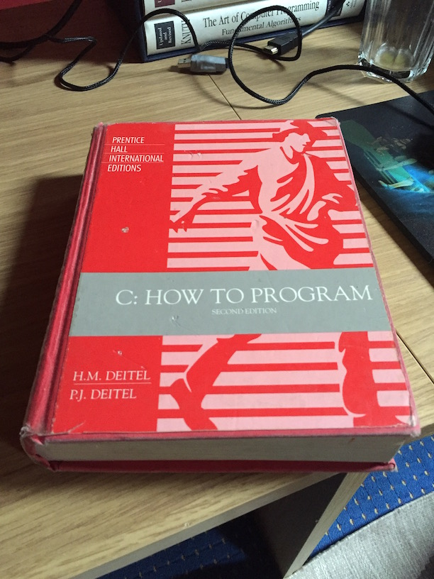

## Learning to Code: Version 0.1
Whilst I'd copied code from magazines, I can't claim to have really learned a lot about coding. On the plus side I wasn't afraid of the ominously blinking command line or the failure caused by something not compiling!

### The Ban Hammer
My first formal attempts to learn how to Code didn't go well. In first year, my secondary school had a 'coding club' setup by a young teacher who dressed like he was practicing for old age. It revolved around BASIC. Given I had already copied BASIC from magazines, I was aware of the hillarious potential of the GOTO statement. I demonstrated this to a classmate with the following.

```
10 PRINT MR SMITH IS A KNOB
20 GOTO 10
```

As the screen scrolled infinitly displaying the payload, the teacher spotted it, and I was barred from coding club, and almost suspended.

### C How To Program
Jump forward a couple of years, my Dad suggested instead of ploughing all my time into pressing they keys 'AWSD', 'SHIFT', 'SPACEBAR' whilst mostly left clicking, I should maybe try doing some programming. There was a night course in the Regional College, I signed myself up, and at 15 found myself sitting in a room full of 40 to 50 year old people listening to a man with an incredibly bizarre accent teach the basics of programming, from logical operators to arrays to linked lists and the maddeningly (at the time) unfathomable pointers. We also covered Object Oriented programming, so polymorphism and all that noise, but not enough about the event based flow of data between objects. I hated it and I loved it. My brain struggled with some of the ideas but at the same time I had an heroic sense of achievement when I thinks clicked.

I still have the book from the course. I must reread it actually, now that I have a few (20) years of experience behind me.



This early education would prove to be a blessing and a curse later when I went to university, but more on that later.