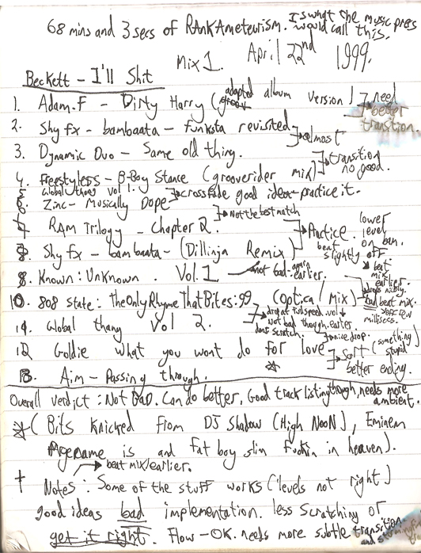
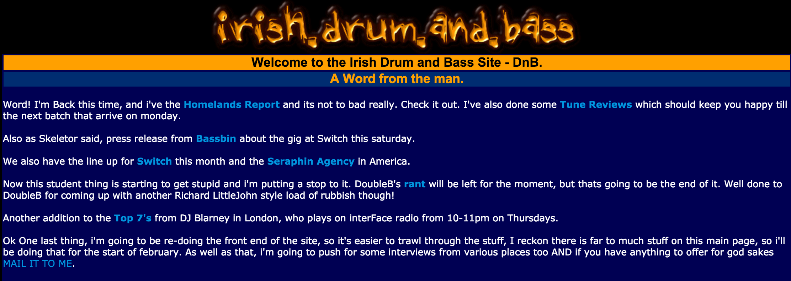

## Musical Stylings
Life doesn't run in parallel, it has many strands and intersections, and as I mentioned at the outset, seemingly unrelated things can effect you in ways you couldn't guess at the time. My involvement in music, DJ'ing and production was definitely one of those things.

The whole story of this is way too long to write up now, so i'll just throw in some of the main things.

### Practice makes perfect
This was probably the first time I got into something where I totally sucked at it. DJ'ing is hard, well it was before automatic beat matching, when you had to match two different sound sources playing at different speeds. To start with it is nigh on impossible, and it sounds bad when you suck. The term is train wrecking. To not train wreck constantly, you need to practice, and I did. Hours on end, I'd literally lock myself in a room for 3 to 4 hours a day and practice the same mix over and over again until it was perfect.

I recorded absolutely everything, I made notes...they were pretty honest

In the end this taught me a valuable lesson in applying yourself, now, with gaps of months between mixes, without thinking about it I can fire up my turntables and rattle out pretty sweet mixes.

### Be like water
Another valuable lesson from my world of music is that of [Flow](https://en.wikipedia.org/wiki/Flow_(psychology)). When you got locked into a beat, or a mix, or a synth line, you are almost unstoppable, you can achieve a Zen like state when you are fully immersed and enjoying what you are doing, not quiet sure how this works, or what other peoples experience of this is, but I can pretty much get into Flow by hooking back into a task with some level of background music to act as a buffer to other distractions.

### A hangar full of people can't be wrong
Before I got into DJ'ing, I hated situations involving crowds, I’m still not a fan of it truth be told, but, it doesn't worry me anymore. Why? Try standing on an elevated platform, with your own personal music collection getting played very loudly, whilst being critiqued by hundreds of people who will most definitely hear you make a balls of a mix. A standout quote, can't quite remember who said it, but it was one of the [Bassbin](http://www.discogs.com/label/1719-Bassbin) crew who gave these words of encouragement to someone before they played:

> 'Don't worry, if you fuck up, everyone will think you are a dick'
>
> _Someone, Switch, 1997_

Doing this is scary, but, it was also a total buzz. Seeing a crowd going nuts to music you've selected, practiced putting together, doing _that_ mix over and over again so you cut from one tune to another perfectly...where people talk about it over and over afterwards, it's unbelievable. You get the same satisfaction from speaking about stuff you care about to a room full of people, and you know what? You won't cop an epic beatdown if you don't nail it.

### Technology can change things
A year or two into my burgeoning career of DJ'ing, myself and a good friend of mine Stephen Duffy started looking around online for information about Drum and Bass (that's what I mostly played) gigs in Ireland. Turned out there wasn't any. Both of us had over the years learned some things about 'computers' from games and what not, so we decided to build something, we needed to find info and we thought others would to.

I think I'm right in saying that this crappy site turned into something pretty special and resulted in bringing together people from all over the country, at it's height it had a massively active forum, no end of event listings, we did DIY interviews with a lot of big names in the scene, got us hooked into doing live shows on BBC 1Xtra, got gigs at clubs and festivals and a lot more.

All because at the right time we built a website. What an unbelievable lesson in the value of satisfying user needs. Sadly, the site declined in use thanks to the proliferation of Facebook, which killed off the forum and event listings, and a lack of time to pivot has meant handing over the reigns.