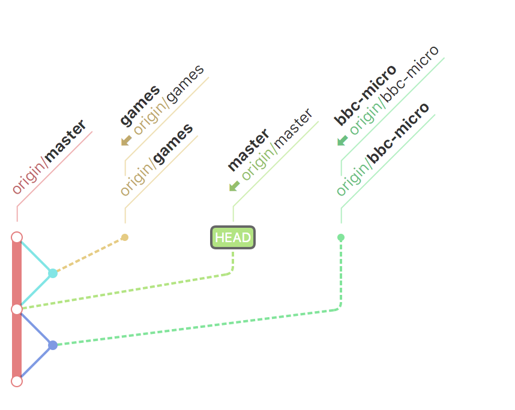

# From Zero to Principal Architect
## Introduction
### What the hell is this?
This is a story about how I travelled through time to my current work position. It is a living CV, documented with Git branches, detailing not just work expierence, but experience in general. 

### This is Not a CV
CV is the wrong word. We are badly served by CVs. They are business 1.0, from an era where we hired for tasks, not for experience, aptitude and attitude, world view and opinion. When I say we, I mean the sort of people I love to work with, motivated by a desire to be better, and to do better for everyone they work with.

CVs are a checklist of buzz words, we all know we twist and turn them in different ways to suit the job description presented, to sell yourself into a role, to sell a role to a client, to sell an idea, to let intermediate recruitment filters pass on our payload of job history with rudimentary header inspection.

We all know how it works, you stick in the relevant experience tailored to fit the bill, the recipient scans it for blatant lies and inconsistencies, barely reaches past year 3 or 4 on the list and decides whether you are worth a closer look.

### An Alternative Proposition
The person you are is much more than that...it is years of collected experience, decision and indecision, events beyond our control, seemingly unconnected ideas, interests and opportunities. 

Hence this little experiment. It was born out of a conversation with [Peter Campbell](https://medium.com/@petecam), a fellow Kainos person, where we wanted to figure out what it is that made us the people we are and why we are in the roles we found ourselves in, and how can we share that experience with others.

There must be something more than just time served amongst 'Enterprise' architecture and beyond, more than sticking down really unhelpful tags on a CV like 'XPATH EXPERT'. This won't be for everyone, but hopefully if it resonates with you, let me know on twitter [@rory80hz](https://twitter.com/rory80hz) and if you are looking for a job, also, let me know, you might be the sort of person we are after.

### Right Now.
This is the bit that will change as time goes by, but right now, I am Principal Architect with Kainos, working in their Gov BU, currently engaged with GDS as Product Manager for the Government PaaS offering.

PaaS done right is an immense game changer, so this is a super cool thing to be involved in. I'm also massively interested in how to make things better for teams building services, users as a first class citizen, design, security, operations and testing. 

> "Yeah right, you are mad into everything?" 
>
> _You, just now_

Yes...pretty much, Why? well, thats the point of this excercise, lets see if I can figure that out.

### How do you use this thing?
Well, it's Git. Git reprents the divergence and convergence of code over time. Well, how about instead of code, we use that to represent ideas. Ideas in the form of paragraphs of a 'Living Experience Tree'. Want to see the history as a timeline? Look at the git history in something like [Source Tree](https://www.sourcetreeapp.com/) or [gitup](http://gitup.co/). The words provide the narrative for the various ideas and threads.

## From Then to Now

* [Tiny Acorns](tiny-acorns.md)
* [Games! The early days](games-early-days.md)
* [Learning to Code: Version 0.1](learning-to-code.md)

